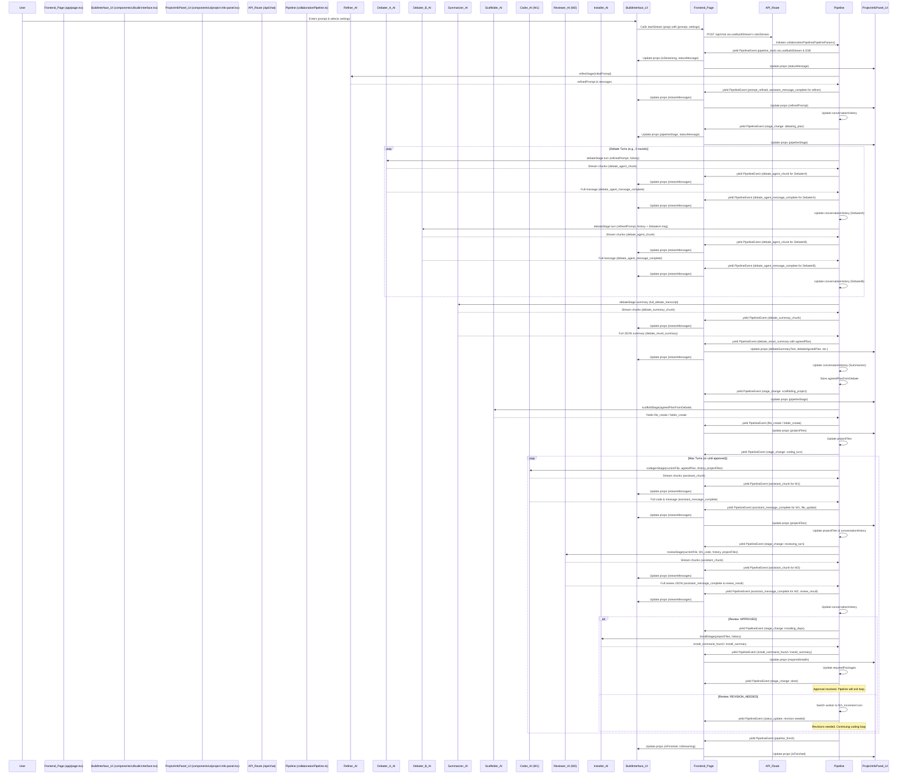

  

# 🚀 VibeCodeDuo - Turn-Based Orchestrator: Revolutionizing AI Collaboration & Advancing Vibe Coding 🔥

Welcome to **VibeCodeDuo**, a cutting-edge platform that pioneers a **Turn-Based Orchestrator** for AI-driven software development! 🎉 We're moving beyond simple prompt-and-response AI into a **stateful, iterative pipeline** where specialized AI agents collaboratively **plan, scaffold, build, review, and refine** software projects—embodying and advancing the principles of **"vibe coding"** with enhanced structure and transparency.

## 💡 The Vision: Orchestrating Intelligent, Collaborative AI Development

VibeCodeDuo is engineered to simulate and augment a sophisticated software development lifecycle using multiple AI agents. Inspired by the "vibe coding" paradigm—where development is driven by natural language and iterative AI collaboration—we add layers of **specialization, review, and observable process** to create robust and high-quality software. Our customizable AI models (OpenAI & Ollama) work in distinct roles, pushing projects from ideation to tangible code.

---

## 🔍 How It Works

---

### 🔑 Key Principles & How VibeCodeDuo Elevates "Vibe Coding"

*   **Specialized Multi-Agent Collaboration with Upfront Planning** 🧠💬🤖
    *   VibeCodeDuo employs a team of AI agents, each with a specific role, mirroring real-world development teams and addressing common "vibe coding" concerns about code quality:
        *   **Refiner Bot:** Ensures precise requirements by clarifying user prompts.
        *   **✨ Debate Duo (Debater A & Debater B, Summarizer):** Two AI agents engage in critical discussions to propose and critique high-level implementation plans *before* any scaffolding or coding begins. A Summarizer AI then distills this debate into an `agreedPlan`, options, and identifies if further resolution is needed. This proactive planning mitigates issues like technical debt and improves architectural soundness.
        *   **Scaffolder AI:** Generates initial project file/folder structures based on the `agreedPlan` from the Debate Stage, providing a solid foundation.
        *   **Coder Bot (Worker 1):** Focuses on iterative code generation based on the refined plan.
        *   **Reviewer Bot (Worker 2):** Conducts structured code reviews, identifying issues and ensuring alignment with best practices.
    *   This turn-based, role-specific approach, featuring a dedicated debate/planning phase, promotes higher quality and more maintainable code.

*   **Stateful & Event-Driven Pipeline** 🌱🔄
    *   The backend orchestrator (`collaborationPipeline.ts`) manages the entire project lifecycle.
    *   **The frontend (`app/page.tsx`) calls a single instance of the `useBuildStream` hook**, which manages the Server-Sent Event (SSE) connection and the comprehensive state of the build process (messages, files, stages, errors, etc.). This centralized state management is crucial for UI consistency.

*   **Unprecedented Transparency & Observability** 📡💬
    *   Tackling a key challenge of "vibe coding"—the "black box" nature of AI—VibeCodeDuo streams **all `PipelineEvent`s via SSE**.
    *   **✨ Full AI Message Visibility:** Users see the *complete* textual output from AI agents directly in the chat (`BuildInterface`), not just placeholders. This empowers users to understand and learn from the AI's decision-making process.
    *   **✨ Dedicated Project Information Panel (`ProjectInfoPanel.tsx`):** This panel provides a clear, persistent display of key outputs like the `refinedPrompt`, `debateOutcome` (including the `agreedPlan`), and generated `projectFiles` and `requiredInstalls`. This separation of concerns enhances UI clarity.
    *   A **"Code applied to editor"** indicator provides clear feedback on when generated code is integrated.

*   **IDE-Centric User Experience** 🖥️✨
    *   The frontend provides an immersive, IDE-like environment.
    *   Child components like `BuildInterface.tsx` and `ProjectInfoPanel.tsx` receive data and action handlers as props from `app/page.tsx`, ensuring a clean data flow.
    *   Features include a dynamic file tree, a multi-tab Monaco editor, and clear status updates.

---

## 🔥 Current Status & Achievements (Post State Synchronization & Loop Fixes)

### 🔧 Backend (`/lib/orchestration/`, `/api/chat/route.ts`)

*   **✅ Fully Functional Orchestration Pipeline with Integrated Debate Stage:**
    *   `debateStage` successfully implemented and integrated, influencing `scaffoldStage`.
    *   Robust turn-based loop: Refiner ➔ **Debate (Proposer, Critiquer, Summarizer)** ➔ Scaffolder ➔ Coder ➔ Reviewer ➔ Revisions ➔ Installer.
*   **✅ Advanced LLM Service & JSON Parsing.**
*   **✅ Real-Time Streaming (SSE) & Stateful Context Management.**

---

### 🌐 Frontend (`app/page.tsx`, `hooks/useBuildStream.ts`, `components/ui/`)

*   **✅ Resolved "Maximum update depth exceeded" Error & State Synchronization Issues:**
    *   **Centralized State Management:** `useBuildStream` is now called **once** in `app/page.tsx`, serving as the single source of truth for stream data.
    *   **Props-Driven Child Components:** State and action handlers (`startStream`, `stopStream`) are passed down as props to `BuildInterface` and `ProjectInfoPanel`, eliminating multiple hook instances and ensuring consistent data.
    *   This architecture has stabilized the UI, preventing re-render loops and ensuring timely updates to all relevant components.
*   **✨ Core "Vibe Coding" Enhancement: Full Chat Transparency & Debate Visibility:**
    *   Complete AI output displayed in `BuildInterface`.
    *   Dedicated `ProjectInfoPanel` clearly shows debate outcomes, refined prompt, and project artifacts.
*   **✅ Dynamic & Interactive UI:**
    *   `useBuildStream.ts` hook robustly processes and manages all `PipelineEvents`, including new debate-related ones.
    *   `BuildInterface.tsx` and `ProjectInfoPanel.tsx` correctly display data received via props.
    *   Real-time file tree updates.
    *   Multi-tab Monaco editor.
*   **✅ Robust State Management (Zustand for UI/Tabs, `useReducer` in `useBuildStream`) & User Feedback.**

---

## ✨ Built With

*   💚 Next.js 15 (App Router, Edge Runtime)
*   🎨 Tailwind CSS / Shadcn UI / Radix UI Primitives / Lucide Icons
*   🤖 OpenAI & Ollama Model Support
*   🔄 Server-Sent Events (SSE) & `useReducer` for complex hook state
*   📝 TypeScript
*   💻 Monaco Editor
*   🏪 Zustand (for UI stores like `useTabStore`, `useUIStore`)
*   📖 `react-markdown` & `react-syntax-highlighter`

---

## 🗺️ Roadmap & Next Steps

### ✅ **Recently Completed: Frontend State Architecture Refactor & `debateStage.ts` Integration**
*   **Achievement:** Successfully refactored the frontend to use a single `useBuildStream` instance in `app/page.tsx`, resolving critical re-render loops and state synchronization problems. This enabled the correct display of all pipeline stages, including the newly integrated `debateStage.ts` outputs, in the `ProjectInfoPanel` and `BuildInterface`.
*   **Impact:** Massively improved UI stability and reliability. The application now correctly reflects the backend's state changes in real-time. The debate stage's upfront planning is now effectively visualized.

### 🎈 Near-Term (Improving the Core "Vibe")
*   **Enhanced User Interaction:** Allow users to pause, provide feedback, or guide the AI mid-pipeline more effectively (e.g., during the debate if `requiresResolution` is true).
*   **User Customization:** Implement UI for per-role prompt control, allowing users to fine-tune AI behavior (e.g., reviewer strictness, coder verbosity, debater personas).
*   **Refine Scaffolding & Codegen from Debate:** Further optimize how `scaffoldStage` and `codegenStage` utilize the `agreedPlan` and `options` from the debate, especially for multi-file projects.
*   Address any remaining minor UI warnings and continue refining LLM prompts for all stages.

*(The rest of your Roadmap, Demo Instructions, and Why It Matters sections look great and can largely remain as they are, as they describe the project's vision and broader goals which are still valid and even more achievable now!)*

---

## 🌟 Demo Instructions

1.  Set up `.env.local` with `OPENAI_API_KEY_WORKER1` and `OPENAI_API_KEY_WORKER2`.
2.  Configure Ollama if using local models.
3.  `pnpm install` & `pnpm dev`.
4.  Visit [localhost:3000](http://localhost:3000) and provide a project prompt.
5.  Observe the AI team plan, scaffold, code, and review your project live! ✨

---

## 🌍 Why VibeCodeDuo Matters: Advancing "Vibe Coding" Responsibly

**VibeCodeDuo** is more than just an AI coding tool; it's an exploration into structured, transparent, and collaborative AI-driven software development. It embraces the accessibility and speed of "vibe coding" while addressing its common critiques:

*   ✅ **From "Black Box" to "Glass Box":** By making the entire AI thought process and decision-making visible (full chat content, staged pipeline, dedicated info panels), VibeCodeDuo demystifies AI development and turns it into a learning opportunity.
*   ✅ **Quality & Iteration over Raw Speed:** The built-in review cycles and specialized agent roles promote higher code quality and iterative refinement, moving beyond simple code generation towards production-readiness.
*   ✅ **Structured Approach to AI Teaming:** Simulates a development team, including proactive planning via the Debate Stage and scaffolding, for more robust and well-thought-out software.

**Use Cases:**

*   🚀 **Rapid Prototyping & MVP Development:** Generate functional application skeletons and features in hours, not weeks.
*   🎓 **Accelerated Learning:** Understand best practices and complex code by observing AI collaboration and decision-making.
*   📈 **Augmenting Developer Productivity:** Automate boilerplate, get instant code reviews, and explore alternative solutions with AI partners.
*   🏢 **Enterprise Adoption:** The structured, review-gated process offers assurances for code quality and maintainability.
*   🔬 **Research Platform:** Investigate multi-agent systems, human-AI interaction, and the future of automated software engineering.

VibeCodeDuo aims to be a cornerstone tool for developers, educators, and businesses looking to harness the power of collaborative AI in a structured, transparent, and effective manner. The potential of VibeCodeDuo to be a transformative tool that can genuinely help many people, potentially even addressing issues of poverty and suffering by democratizing software creation and empowering individuals. This project is more than just code; it's about impact.

