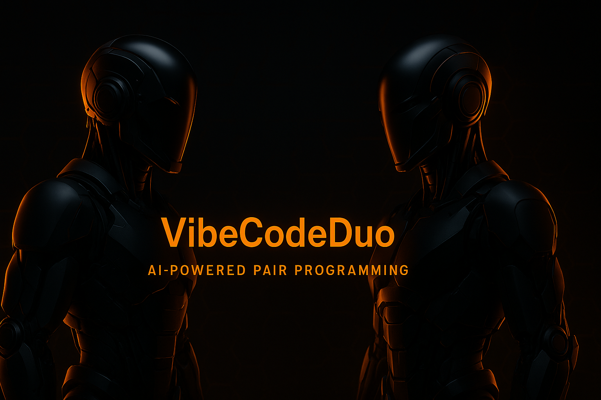

  

# 🚀 VibeCodeDuo - Turn-Based Orchestrator: A Revolution in AI Collaboration 🔥

Welcome to **VibeCodeDuo's** cutting-edge **Turn-Based Orchestrator** branch! 🎉 This powerful feature **redefines the way AI agents collaborate** to create and refine software. We’re moving beyond mere concurrent AI responses and building a **stateful, turn-based pipeline** where AI agents **build, review, and iteratively refine** software projects.

## 💡 The Vision: Orchestrating Seamless Multi-Agent AI Collaboration

At the heart of VibeCodeDuo is a **game-changing AI collaboration system** designed to simulate a real-world software development process. Multiple **AI models**—customizable for both OpenAI and local Ollama instances—work in tandem to **refine** and **iterate** on each other’s contributions. This isn’t just a chat; this is **live collaboration** between **AI agents** with distinct roles, pushing code forward, reviewing progress, and refining results.

### 🔑 Key Principles of the System

* **Multi-Agent Collaboration** 🧠🤖

  * Orchestrates a "Refiner" bot to clarify user prompts and two "Worker" bots: Worker 1 for code generation, and Worker 2 for structured code review. These bots work in a **turn-based loop** to ensure optimal code output.

* **Stateful Pipeline** 🌱🔄

  * Managed by the backend orchestrator (`collaborationPipeline.ts`), this system seamlessly handles the entire project lifecycle—tracking files, maintaining conversation history, and adjusting collaboration flow based on feedback from Worker 2 (Review Bot).

* **Structured Communication** 📡💬

  * Using **Server-Sent Events (SSE)**, this pipeline streams rich `PipelineEvent`s (like file changes and AI output) directly to the frontend for **real-time updates**.

* **IDE-Centric UI** 🖥️✨

  * The frontend mirrors the feel of a real-world IDE, displaying not just a **chat log**, but a **live build process**—showing every update, file change, and agent interaction.

---

## 🔥 Current Status & Achievements

### 🔧 Backend (`/lib/orchestration/`, `/api/chat/route.ts`)

* **✅ Fully Functional Orchestration Pipeline:**

  * Multi-turn loop (Refiner ➔ Worker 1 ➔ Worker 2 ➔ Worker 1 revisions)
  * Smart branching via `status: APPROVED` or `REVISION_NEEDED`

* **✅ Structured JSON Reviews:**

  * Worker 2 returns clean, actionable JSON reviews parsed by `parseReviewOutput()`

* **✅ Live Streaming & State Sync:**

  * Using SSE, all stage/status/file events stream in real time with stateful memory across turns

* **✅ Context Management:**

  * `getTruncatedHistory()` keeps context windows efficient to avoid model token overflows

---

### 🌐 Frontend (`/hooks/useBuildStream.ts`, `/components/ui/BuildInterface.tsx`)

* **✅ Real-Time Streaming UI:**

  * Displays messages from each bot, refined prompts, and code file updates

* **✅ Syntax Highlighting (NEW):**

  * Code is rendered with `react-syntax-highlighter` for improved readability and developer experience

* **✅ Stream Lifecycle Controls:**

  * Users can start/stop the stream and view live turn progress

---

## ✨ Built With

* 💚 Next.js 15
* 🖊️ Tailwind CSS / Radix UI / Lucide Icons
* 🚀 OpenAI & Ollama model support
* 🔄 Server-Sent Events (SSE)
* 📝 TypeScript

---

## ⚠️ Known Issues & Roadmap

### 🎈 Near-Term (UI/UX Polish)

* Syntax highlighting (done!)
* Improve AI message readability in chat
* Highlight `pipeline_error` events clearly
* Button logic refinement (start/stop/reset controls)

### 🚀 Mid-Term

* Multiple file support
* File tree & tabbed editing
* AI-driven file scaffolding

### 🔀 Long-Term

* AI memory snapshots & summarization
* Per-role prompt control UI
* Auto-resume from failure or user input

---

## 🌟 Demo Instructions

1. Create a `.env.local` file with `OPENAI_API_KEY_WORKER1` and `OPENAI_API_KEY_WORKER2`
2. Run `pnpm install`
3. Start with `pnpm dev`
4. Visit [localhost:3000](http://localhost:3000) and input a task prompt
5. Watch the bots collaborate and build your project ✨

---

## 🌍 Why It Matters

**VibeCodeDuo** introduces a paradigm shift:

* ✅ **Iterative AI Collaboration**, not just prompts and completions
* ✅ **Live coding by two AI roles** (Builder + Reviewer)
* ✅ **Structured, observable development cycles**

Use cases include:

* 💡 Prototyping apps with minimal human input
* 📈 Demoing LLM-based developer tooling
* 💮 Selling AI-accelerated workflows to clients or teams
* 📑 Research in agent-based cooperation models

This isn’t just software—it’s a demonstration of how multi-agent AI can **build software together**.

---
 🌈🖋️

  * Add **syntax highlighting** for the code displayed in `BuildInterface.tsx` to improve readability (consider using `react-syntax-highlighter`).

* **Chat/Log Formatting:** 📜💬

  * Clean up how **AI explanations** and **reviews** are displayed, ensuring smoother UX by distinguishing between message types.

* **Error Handling:** ❌⚠️

  * Ensure **errors** (e.g., `pipeline_error` events) are clearly communicated in the UI.

* **Button State Logic:** 🔲🔳

  * Refine the state of **"Send"** and **"Stop"** buttons, ensuring proper interaction logic during pipeline execution.

---

### **Advanced Context Management (Future):** 🧠📚

* Investigate **advanced summarization** strategies for long collaborations to maintain a lean and manageable context window while keeping critical data intact.

---

### **Multi-File Project Support (Future):** 📂✨

* Expand the system to handle **multiple files** by:

  * Allowing the AI agents to **propose** and **scaffold new files** (`scaffoldStage`).
  * Introducing a tree-like **project file structure**.
  * Allowing the user or AI agents to choose which file to focus on.
  * Updating the frontend to include a **file tree** and **tabbed editors** for easy file navigation.

---

### **In-depth Revision Guidance (Ongoing):** 🔄📝

* Continuously fine-tune the **revision prompts** to ensure that Worker 1 takes **precise actions** based on Worker 2’s review (e.g., addressing `key_issues` with more specificity).

---

## **🚀 How to Run This Branch:**

1. Ensure your `.env.local` is populated with `OPENAI_API_KEY_WORKER1` and `OPENAI_API_KEY_WORKER2`.
2. Run `pnpm install` to install any new dependencies.
3. Start the project with `pnpm run dev`.
4. Open the app in your browser and submit a prompt. **Watch the magic happen** as the AI agents begin their collaborative process!

---
